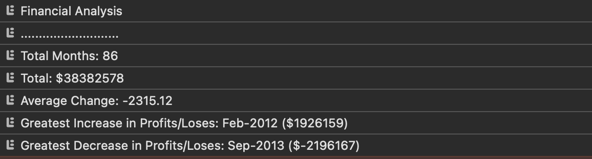

# Console-Finances

## Description

JS script that calculates the total number of items in the array, total net profit loses, average profit/loss, greatest increase and greatest decrease.

## Installation

N/A

## Usage

Link to application: https://fumitsukai.github.io/Bootstrap-Portofolio/

Open console to see the results.

## Credits

N/A

## License

Refer to licence is the repo.